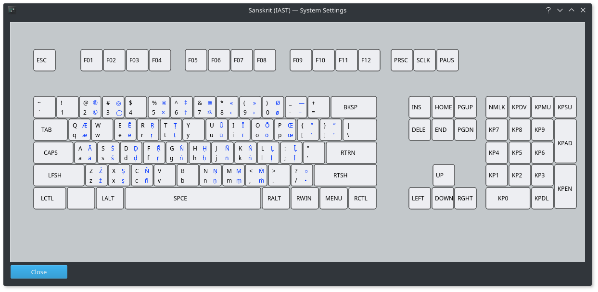

# IAST Transliteration Keyboard on Linux

This is an `XKB keyboard layout` that serves as a Linux equivalent to Toshiya
Unebe’s “EasyUnicode” keyboard layout for macOS. It allows one to easily type
all the standard letters with diacritical marks for roman transliteration of
Sanskrit, Palī, and some other Indic languages. To get “ā” for example, one can
hold the Windows key and press `a`. For “Ā” one holds the Windows key and
`shift` and types `A`. Use the layout picture below to view the location of
available characters.



## Installation

Place the `ia` file in `/usr/share/X11/xkb/symbols`. Add the following code to
the `layout` list section of `/usr/share/X11/xkb/rules/evdev.xml`.

```xml
<layout>
<configItem>
<name>ia</name>
<shortDescription>IAST</shortDescription>
<description>Sanskrit (IAST)</description>
<languageList><iso639Id>Sanskrit</iso639Id></languageList>
</configItem>
</layout>
```

Log out and log back in. You should now be able to add the keyboard in your
Input Devices or Keyboard Layout system settings. Confirmed working on the
latest versions of elementary OS (Hera), Debian (XFCE), Linux Mint (Cinnamon),
and Ubuntu (Unity).

## Customization

See this useful guide: [Building an XKB Keyboard](http://linux.lsdev.sil.org/wiki/index.php/Building_an_XKB_Keyboard)
